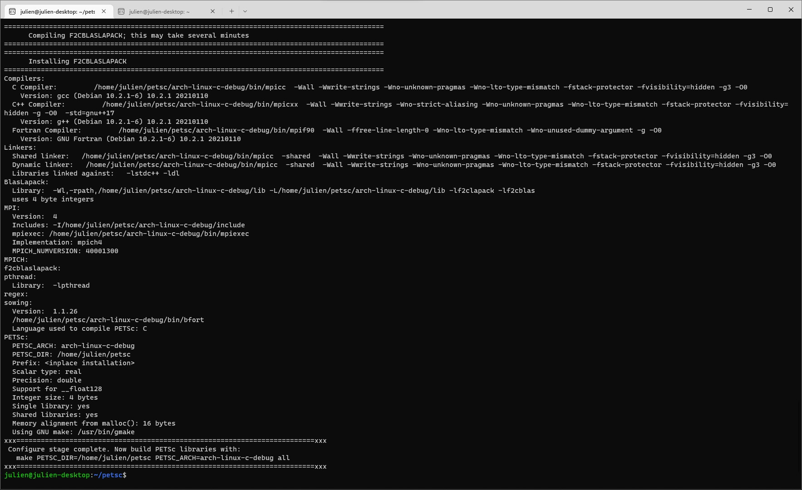
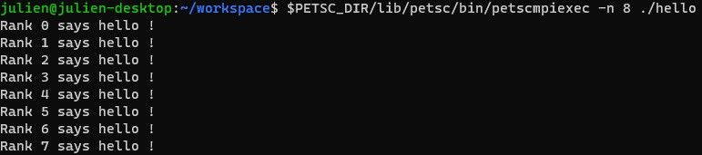

# About... <!-- omit in toc -->

## ... Today !

Created on **June**, **2022**.

## ... the author <!-- omit in toc -->

<div>
<p style="float: right;">  </img> </p>
<p>
My name is Julien VALENTIN. At the creation of this repo, I am 27 seven years old. I currently work in a startup in La Rochelle, France, as a R & D Engineer. My mission is to develop and to implement powerful numerical tools in order to modelize and simulate fabrication processes of composites materials. The maths of this topic is formulated in the continuum mechanics formalism, that allows to write non-linear elasticity problems and rheological fluid flows too. Then, one is able to discretize these systems of equations and to call efficient algorithms in order to solve them. 

If I started my studies with engineering pretty early in High School, I wanted to study the mathematics behind the scene and to understand the fundamental concepts of physics that justify the models used in engineering, so, after one year in CentraleSupélec, I resigned. After that, I came once and for all in University (Sorbonne-Université, Paris, France) and obtained my graduation in applied maths. Now, I am back in the lab, aware of the methods that lead from basic concepts to pretty complex system models. I am able to understand the objects, the hypothesis, and the analysis steps that appear before the software development. Let's code !

Out of the office, I am very curious of data science and machine learning.
</p>
</div>

Learn a bit more with my (french) [C.V]()

## ... this repo <!-- omit in toc -->

This repo means to introduce what I know about computer science and its applications to applied maths and industrial issues. As a young teacher in EPITA (Paris, France), a software engineering school, I also mean to develop teaching materials for my students.

# Table of contents <!-- omit in toc -->
- [The environment](#the-environment)
  - [I.D.Es](#ides)
  - [Version control and project management](#version-control-and-project-management)
  - [Containeering](#containeering)
  - [Sample of useful languages...](#sample-of-useful-languages)
  - [Other useful platforms...](#other-useful-platforms)
  - [Package managers](#package-managers)
- [Downloads](#downloads)
  - [CUDA Toolkit](#cuda-toolkit)
  - [FEniCs](#fenics)
  - [FreeFEM++](#freefem)
  - [GNU Plot](#gnu-plot)
  - [Intel OneAPI Toolkits for *C/C++*](#intel-oneapi-toolkits-for-cc)
  - [Intel OneAPI Toolkits for *Fortran90*](#intel-oneapi-toolkits-for-fortran90)
  - [Julia](#julia)
  - [Open MPI](#open-mpi)
  - [PETSc](#petsc)
  - [Python](#python)
  - [Rheolef](#rheolef)
  - [SageMath for *Windows*](#sagemath-for-windows)
  - [Scilab](#scilab)
  - [SLEPc](#slepc)
- [Setup the environment](#setup-the-environment)
  - [Set *W.S.L v.2* up](#set-wsl-v2-up)
  - [Set *Conda* up in a Debian-based distribution](#set-conda-up-in-a-debian-based-distribution)
    - [Conda cheatsheet](#conda-cheatsheet)
  - [Set *PETSc* up in a *Linux* distribution](#set-petsc-up-in-a-linux-distribution)
- [What's next ?](#whats-next-)

# The environment

I work on [Windows 11](https://www.microsoft.com/en-us/windows/windows-11) with [W.S.L v2](https://docs.microsoft.com/en-us/windows/wsl/) with the famous [Debian](https://www.debian.org/index.en.html) distribution.

## I.D.Es

My favourite I.D.E is [Microsoft Visual Studio](https://visualstudio.microsoft.com/) software, that I do not really use actually. I develop my scripts in [Microsoft Visual Studio Code](https://code.visualstudio.com/) to write simple programs in my favourites languages. In [Visual Studio Code](https://code.visualstudio.com/), I recommand these extensions

- [C/C++ Extension Pack](https://marketplace.visualstudio.com/items?itemName=ms-vscode.cpptools-extension-pack), from Microsoft ;
- [Docker](https://marketplace.visualstudio.com/items?itemName=ms-azuretools.vscode-docker), from Microsoft ;
- [Julia](https://marketplace.visualstudio.com/items?itemName=julialang.language-julia), from julialang ;
- [Jupyter](https://marketplace.visualstudio.com/items?itemName=ms-toolsai.jupyter), [Jupyter Keymap](https://marketplace.visualstudio.com/items?itemName=ms-toolsai.jupyter-keymap) and [Jupyter Notebook Renderers](https://marketplace.visualstudio.com/items?itemName=ms-toolsai.jupyter-renderers), from Microsoft ;
- [Markdown All In One](https://marketplace.visualstudio.com/items?itemName=yzhang.markdown-all-in-one), from Yu Zhang ;
- [Modern Fortran](https://marketplace.visualstudio.com/items?itemName=fortran-lang.linter-gfortran), from The Fortran Programming Language ;
- [Python](https://marketplace.visualstudio.com/items?itemName=ms-python.python) and [Pylance](https://marketplace.visualstudio.com/items?itemName=ms-python.vscode-pylance), from Microsoft ;
- [Remote Development](https://marketplace.visualstudio.com/items?itemName=ms-vscode-remote.vscode-remote-extensionpack), from Microsoft ;
- [Scilab](https://marketplace.visualstudio.com/items?itemName=mammothb.scilab), from Mammothb ;
- [vscode-FreeFEM](https://marketplace.visualstudio.com/items?itemName=Pierre-Marchand.vscode-freefem), from Pierre Marchand.

## Version control and project management

[Git](https://git-scm.com/) is an abvious choice to manage a project. I use [GitHub Desktop](https://desktop.github.com/) to stock and share these remotely on [Github](https://github.com/).

## Containeering

Some tools are a bit tricky to deploy, but are often available through a [Docker](https://www.docker.com/) image. That is why one should consider to install it on his computer.

## Sample of useful languages...

All of the following are freely available programming languages that suit for engineering or maths developments.

- [C](https://en.wikipedia.org/wiki/C_(programming_language))
- [C++](https://en.wikipedia.org/wiki/C%2B%2B)
- [Fortran90](https://www.fortran90.org/)
- [FreeFEM++](https://freefem.org/)
- [GNU Plot](http://www.gnuplot.info/)
- [Julia](https://julialang.org)
- [PETSc](https://petsc.org/release/)
- [Python](https://www.python.org/)
- [Rheolef](https://membres-ljk.imag.fr/Pierre.Saramito/rheolef/html/index.html)
- [SageMath](https://www.sagemath.org/)
- [Scilab](https://www.scilab.org/)
- [SLEPc](https://slepc.upv.es/)

## Other useful platforms...

- [CUDA](https://developer.nvidia.com/cuda-toolkit)
- [FEniCs](https://fenicsproject.org/)
- [MPI](https://www.open-mpi.org/)
- [PyTorch](https://pytorch.org/)
- [Tensorflow](https://www.tensorflow.org/)

## Package managers

Package managers allow to maintain efficiently a development environment. For instance, [Anaconda](https://www.anaconda.com/) is very popular and powerful. In practice, one may install [Miniconda](https://docs.conda.io/en/latest/miniconda.html), a minimal distribution of *Anaconda*. An alternative to *Anaconda* is [Mamba](https://mamba.readthedocs.io/en/latest/).

# Downloads

Click on the titles, they are linked to download pages.

## [CUDA Toolkit](https://developer.nvidia.com/cuda-downloads)

## [FEniCs](https://fenicsproject.org/download/archive/)

## [FreeFEM++](https://doc.freefem.org/introduction/download.html)

## [GNU Plot](http://www.gnuplot.info/download.html)

## [Intel OneAPI Toolkits](https://www.intel.com/content/www/us/en/developer/articles/tool/oneapi-standalone-components.html#dpcpp-cpp) for *C/C++*

## [Intel OneAPI Toolkits](https://www.intel.com/content/www/us/en/developer/articles/tool/oneapi-standalone-components.html#fortran) for *Fortran90*

## [Julia](https://julialang.org/downloads/)

## [Open MPI](https://www.open-mpi.org/software/ompi/v4.1/)

## [PETSc](https://petsc.org/release/install/)

## [Python](https://www.python.org/downloads/)

## [Rheolef](https://membres-ljk.imag.fr/Pierre.Saramito/rheolef/html/download_page.html)

## [SageMath](https://github.com/sagemath/sage-windows/releases) for *Windows*

## [Scilab](https://www.scilab.org/download/scilab-6.1.1)

## [SLEPc](https://slepc.upv.es/documentation/instal.htm)

# Setup the environment

## Set *W.S.L v.2* up

Open a terminal, for example with `<win>+<r>`, type `cmd` and press `<enter>`. Run `wsl --install` to install the default distribution, the last stable distro of Ubuntu. To install an other distribution : `wsl --list --online` prints all available distributions, then one may run, for instance, `wsl --install -d Debian`. The first launch requires to select a user name and a password.

To maintain the installation, run `wsl --update`. To set the default version of WSL : `wsl  --set-default-version 2`, the other option being `1`. The second version enables virtual graphics server, one can use a virtual desktop server from its linux environment.

To run a graphical application from linux, run `wsl.exe ./myApp` from the linux terminal. Conversely, one can run a linux command from a Windows terminal with `wsl myApp`.

Finally, the Remote Development, extensions package, available for V.S Code, enables virtual development environment installed on Linux.

## Set *Conda* up in a Debian-based distribution

Let use the official debian repo. In a *Linux* terminal, run

```bash
mkdir conda
cd conda
curl https://repo.anaconda.com/pkgs/misc/gpgkeys/anaconda.asc | gpg --dearmor > conda.gpg
```

Then, run

```bash
sudo install -o root -g root -m 644 conda.gpg /usr/share/keyrings/conda-archive-keyring.gpg
```

Check this step with `gpg --keyring /usr/share/keyrings/conda-archive-keyring.gpg --no-default-keyring --fingerprint 34161F5BF5EB1D4BFBBB8F0A8AEB4F8B29D82806`.

Add the debian repo of *Anaconda* :

```bash
echo "deb [arch=amd64 signed-by=/usr/share/keyrings/conda-archive-keyring.gpg] https://repo.anaconda.com/pkgs/misc/debrepo/conda stable main" | sudo tee -a /etc/apt/sources.list.d/conda.list
```

The package is ready to be installed ! Try

```bash
sudo apt update
sudo apt install conda
```

Finish the installation with

```bash
source /opt/conda/etc/profile.d/conda.sh
```

### Conda cheatsheet

- **list** environments : `conda env list`
- **create** an environment by its name : `conda create -n <name>`
- **activate** an anvironment : `conda activate <name>`
- **install** new packages with or without specs : `conda install <package>` or `conda install <package> >= <version>` and so on...
- **list** packages in this environment : `conda list`
- **deactivate** an environment : `conda deactivate`
- **remove** an environment : `conda env remove -n <name>`
- **update** *conda* : `conda update conda`

## Set *PETSc* up in a *Linux* distribution

First, one must install some dependencies. Open your *Linux* terminal and start typing

```bash
sudo apt-get install --yes g++ gcc gfortran git libblas-dev liblapack-dev python3 python3-pip python3-dev
```

Then, check the installation with the following command

```bash
printf '#include<stdio.h>\nint main(){printf("cc OK!\\n");}' > t.c && cc t.c && ./a.out && rm -f t.c a.out
```

`cc OK!` should appear in the console. Prerequisites are ready. Then, create a folder with `mkdir ~/<folder name>` and clone the stable release of *PETSc* with `git clone -b release https://gitlab.com/petsc/petsc`. Go to the folder : `cd petsc` and configure the package with

```bash
./configure --with-cc=gcc --with-cxx=g++ --with-fc=gfortran --download-f2cblaslapack --download-mpich
```

If this step is a success. An example of result is



Build the library with a command like

```bash
make PETSC_DIR=/home/julien/petsc PETSC_ARCH=arch-linux-c-debug all
```

Check the installation with

```bash
make PETSC_DIR=/home/julien/petsc PETSC_ARCH=arch-linux-c-debug check
```

The script `helloPETSc.c` gives, with the makefile `$PETSC_DIR/src/snes/tutorials/makefile`,



# What's next ?

One can easily explore this repo using the [index](index.md).